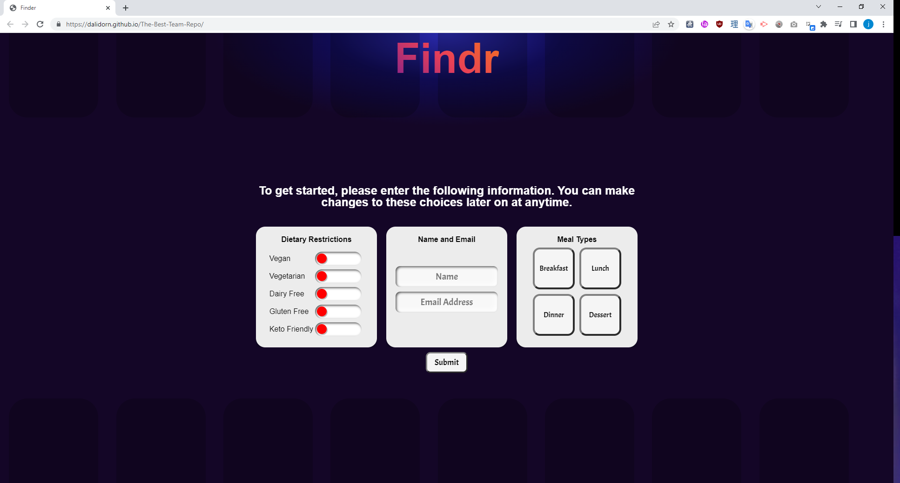

# Findr

Our purpose is to create a front-end, user friendly, application that allows users to quickly find, store, and share preferred recipes. We know meal planning is a dreaded task as meals quickly become repetitive. We want to give users more variety by making preferred recipes (based on dietary preferences) readily available with a recipe discovery app.

## Table of Contents

- [User-Story](#user-story)
- [Technologies-Used](#technologies-used)
- [Preview](#preview)
- [Deployed-Application](#deployed-application)
- [Contributing](#contributing)
- [License](#license)

## User Story

```
As a user,
I want an app that allows me to easily find recipes based on dietary preferences.

So that, I can plans meals and share recipes at ease.

```

## Technologies Used

* HTML 
* CSS
* JavaScript
* Spoonacular API
* Emailjs API
* Interact.js library


<br>

## Preview



## Deployed Application
[link](https://dalidorn.github.io/The-Best-Team-Repo/)

## Contributing
Pull requests are welcome. For major changes, please open an issue first to discuss what you would like to change.

## License
[MIT](https://choosealicense.com/licenses/mit/)


